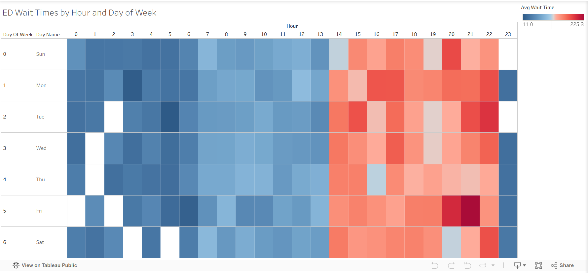

# 🏥 Emergency Department Wait Time & Overcrowding Analysis

This project analyzes Emergency Department visit data to identify peak 
overcrowding periods, high-risk departments, and patient flow bottlenecks 
to help hospital operations teams staff smarter and reduce dangerous delays.

## Problem Statement
ED overcrowding is a critical patient safety and operational issue. Long wait 
times lead to patients leaving without being seen, delayed treatment for critical 
conditions, and financial penalties. This analysis identifies when and where the 
ED is most overwhelmed to enable data-driven staffing decisions.

## Stakeholder Questions
1. What hours and days of the week have the longest average wait times?
2. Which ED departments are most overcrowded?
3. Does patient acuity level affect how long patients wait?
4. What percentage of patients leave without being seen — and when?
5. Which combination of day, hour, and department creates the worst bottlenecks?

## Tools & Technologies
- **Python (pandas, numpy)** — synthetic data generation
- **SQLite** — SQL querying and relational analysis
- **Tableau Public** — operational dashboard with heatmap
- **Google Colab** — project notebook

## Dataset
Three synthetic datasets generated to simulate real ED records:
- `patients` — 600 patients with age, gender, ZIP code, and insurance type
- `visits` — 1,000 visits with arrival time, wait time, and disposition
- `triage` — 1,000 triage records with department, acuity level, and chief complaint

Tables joined on `patient_id` (patients → visits) and `visit_id` 
(visits → triage) demonstrating chained 3-table JOINs.

## SQL Concepts Demonstrated
- `JOIN` across 3 tables — chaining two joins together
- `GROUP BY` + `AVG()` — average wait times by hour, day, and department
- `HAVING` — filtering departments above wait time threshold
- `CASE WHEN` — conditional logic and bucketing
- `strftime()` — extracting hour and day of week from datetime fields
- `Subquery` — identifying worst bottleneck combinations

## Key Findings
- Evening hours (8pm–10pm) have the longest average wait times averaging 
  175–225 minutes — Friday evenings peak at 225 minutes
- General ED has the highest patient volume (331 visits) while Cardiac has 
  the longest average wait at 105 minutes
- This synthetic dataset suggests critically ill patients may not be consistently prioritized over lower-acuity patients
   — Level 1 (life-threatening) waits nearly identical to Level 5 
  (non-urgent). This pattern highlights a potential patient safety concern requiring additional investigation
- 8am has the highest LWBS rate at 19.10% — likely tied to morning shift changes
- Evening overcrowding is systemic across all days of the week, not isolated 
  to weekends

## Recommendation
Staffing adjustments should target evening hours across all days of the week 
rather than weekends only. The triage system requires immediate review — 
critical patients are not being prioritized over non-urgent cases. Implement 
rapid triage protocols and flexible staffing models to address shift-change 
LWBS spikes at 8am.

## Heatmap Visualization

## Dashboard
[View on Tableau Public](https://public.tableau.com/app/profile/carrie.greland/viz/ed_wait_times_analysis/EDOperationsDashboard)

## Notebook
[View in Google Colab](https://colab.research.google.com/drive/12MB4MIdKp4HpVpzLSGQNrY5ZRHRZTMzx?usp=sharing)

## Files
- `ed_wait_time_analysis.ipynb` — full project notebook
- `ED_Wait_Times_Heat_Map.png` — heatmap visualization
- `ED_Operations_Dashboard.png` — full dashboard screenshot
